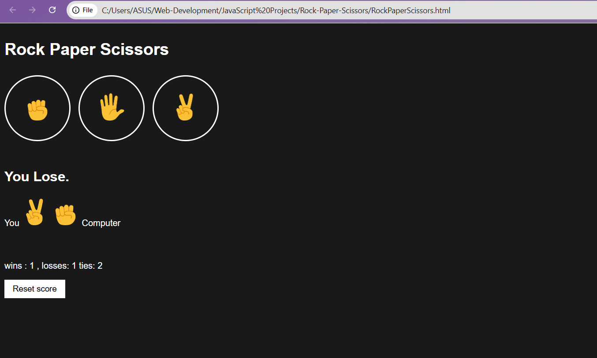

# Rock Paper Scissors 🎮✊✋✌️

A simple Rock Paper Scissors game built using **HTML, CSS, and JavaScript**.  
Play against the computer and test your luck!

---

## 🚀 Features
- Classic Rock, Paper, Scissors gameplay
- Random computer moves
- Score tracking (Player vs Computer)    
- Responsive design for desktop and mobile
- Beginner‑friendly code structure

---

## 📂 Project Structure
rock-paper-scissors/ 

    ├── RockPaperScissors.html            # Main game page

    ├── styles/RockPaperScissors.css            # Styling for the game

    └── scripts/RockPaperScissors.js              # Game logic


## 🕹️ How to Play
1. Choose **Rock**, **Paper**, or **Scissors** by clicking the buttons.
2. The computer will randomly select its move.
3. The winner is decided based on the rules:
   - Rock beats Scissors  
   - Scissors beats Paper  
   - Paper beats Rock
4. Scores are updated after each round.

---

## ⚡ Getting Started
1. Clone the repository:
   ```bash
   git clone https://github.com/khushimishra0306/Web-Development.git
2. Open RockPaperScissors.html in your browser.

3. Start playing!

## 📸 Demo Screenshot




🛠️ Technologies Used

HTML

CSS

JavaScript
